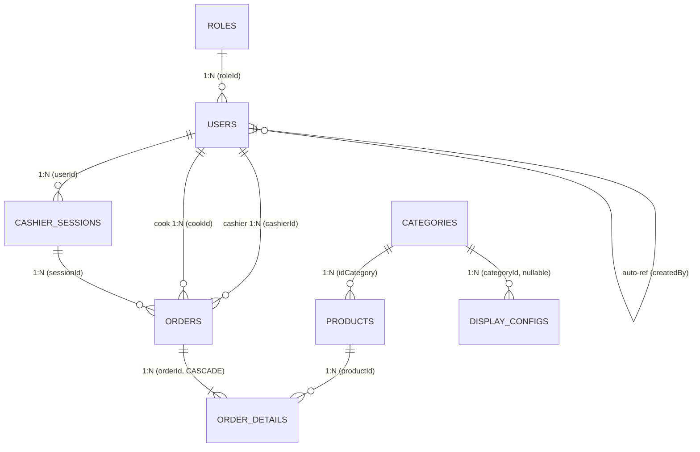

# 📊 Database & Entities

El sistema utiliza **TypeORM** con PostgreSQL. Todas las entidades se encuentran en `src/**/entities/*.entity.ts` con naming strategy `snake_case` en BD y `camelCase` en TypeScript.

---

## 📐 Diagrama Entidad-Relación (ER)

---

## 🗂 Detalle de Entidades

### 👤 `roles` — Tabla de Roles
| Columna | Tipo | Detalles |
| :--- | :--- | :--- |
| `id_role` | PK int | Auto-generado |
| `role_name` | varchar(50) | Único: `ADMIN`, `CASHIER`, `KITCHEN` |

**Relaciones:** `1:N → users`

---

### 👤 `users` — Usuarios del Sistema
| Columna | Tipo | Detalles |
| :--- | :--- | :--- |
| `id_user` | PK int | Auto-generado |
| `full_name` | varchar(100) | Nombre completo |
| `password_hash` | varchar(255) | BCrypt hash (`select: false` — nunca se devuelve en queries) |
| `email` | varchar(100) | Único, usado para login |
| `phone` | varchar(20) | Opcional |
| `role_id` | FK int | Referencia a `roles` |
| `is_active` | boolean | Soft-delete. `false` = acceso bloqueado |
| `created_at` | timestamp | Auto-generado |
| `last_access` | timestamp | Actualizado en cada login exitoso |
| `created_by` | FK int | Auto-referencia a `users` (quién lo creó) |

**Relaciones:** `N:1 → roles`, auto-referencia a `users`

---

### 🏷️ `categories` — Categorías de Productos
| Columna | Tipo | Detalles |
| :--- | :--- | :--- |
| `id_category` | PK int | Auto-generado |
| `name` | varchar(100) | Único. Seed: `COMIDA`, `REFRESCOS`, `BEBIDAS CALIENTES`, `POSTRES` |
| `description` | text | Opcional |
| `image_url` | varchar(255) | URL de Cloudinary, opcional |
| `order` | int | Para ordenamiento visual en la UI (0 = primero) |
| `is_active` | boolean | Soft-delete |
| `created_at` | timestamp | Auto-generado |

**Índices:** `name` (unique), `order`, `is_active`  
**Relaciones:** `1:N → products`

---

### 📦 `products` — Catálogo de Productos
| Columna | Tipo | Detalles |
| :--- | :--- | :--- |
| `id_product` | PK int | Auto-generado |
| `code` | varchar(50) | Único. **Autogenerado por el backend** formato `PRO-NEW-{n}` (basado en `id_product`). El frontend no lo envía. |
| `name` | varchar(150) | Nombre del producto |
| `description` | text | Opcional |
| `price` | decimal(10,2) | Precio actual de venta |
| `id_category` | FK int | Referencia a `categories` |
| `image_url` | varchar(255) | URL almacenada en Cloudinary |
| `is_active` | boolean | Soft-delete (`toggleActive`) |
| `created_at` | timestamp | Auto-generado |
| `updated_at` | timestamp | Auto-actualizado |

**Índices:** Compuesto `(id_category, is_active)` para optimizar queries de productos activos por categoría.  
**Relaciones:** `N:1 → categories`, `1:N → order_details`

> [!NOTE]
> El campo `code` NO lo envía el frontend. El backend lo genera siempre al crear con formato `PRO-NEW-{n}` (donde `n` = `id_product` con padding a 3 dígitos, ej. `PRO-NEW-001`). El prefijo `PRO-NEW-` garantiza que nunca colisiona con los códigos legacy `PROD-*` existentes en la BD.

> [!NOTE]
> No se elimina físicamente un producto con historial de ventas. En su lugar se usa `isActive = false`.

---

### 📺 `display_configs` — Configuraciones de Pantalla TV
| Columna | Tipo | Detalles |
| :--- | :--- | :--- |
| `id_display_config` | PK int | Auto-generado |
| `name` | varchar(100) | Nombre descriptivo de la configuración |
| `access_token` | varchar(10) | Código único de 6 caracteres (alfanumérico, auto-generado) |
| `category_id` | FK int | Nullable. Referencia a `categories`. `null` = todos los productos |
| `rotation_interval` | int | Segundos por slide (default: 8, min: 3, max: 60) |
| `transition_type` | varchar(20) | `slide` \| `fade` \| `zoom` (default: `slide`) |
| `show_prices` | boolean | Mostrar precios (default: true) |
| `show_descriptions` | boolean | Mostrar descripciones (default: false) |
| `products_per_slide` | int | Productos por slide (default: 3, min: 1, max: 6) |
| `is_active` | boolean | Config activa (default: true). Inactiva = 404 en endpoint público |
| `created_at` | timestamp | Auto-generado |
| `updated_at` | timestamp | Auto-actualizado |

**Relaciones:** `N:1 → categories` (nullable, `onDelete: SET NULL`)

> [!NOTE]
> El `access_token` es un código corto de 6 caracteres alfanuméricos (sin 0/O/1/I/L para evitar confusión). Se genera automáticamente al crear la configuración y se usa como identificador público en la URL de la TV: `GET /api/display/{token}`.

---

### 💰 `cashier_sessions` — Sesiones de Caja
| Columna | Tipo | Detalles |
| :--- | :--- | :--- |
| `id_session` | PK int | Auto-generado |
| `user_id` | FK int | Cajero responsable |
| `opening_date` | timestamp | **Generado por el servidor** (`new Date()`) al crear la sesión |
| `closing_date` | timestamp | Nullable, **generado por el servidor** al cerrar |
| `initial_amount` | decimal(10,2) | Monto inicial en caja al abrir |
| `total_cash` | decimal(10,2) | Efectivo acumulado por ventas (default: 0) |
| `total_qr` | decimal(10,2) | QR acumulado por ventas (default: 0) |
| `closing_cash_amount` | decimal(10,2) | Efectivo real contado al cierre |
| `closing_qr_amount` | decimal(10,2) | QR real al cierre |
| `total_sales` | decimal(10,2) | Total ventas (cash + qr), excluye canceladas |
| `order_count` | int | Conteo de órdenes activas (se decrementa al cancelar) |
| `difference` | decimal(10,2) | `(closingCash - expectedCash) + (closingQr - expectedQr)` — incluye efectivo y QR |
| `observations` | text | Notas del cajero al cierre |
| `status` | varchar(20) | `OPEN` \| `CLOSED` (default: `OPEN`) |

**Relaciones:** `N:1 → users`, `1:N → orders`

---

### 🧾 `orders` — Órdenes / Ventas
| Columna | Tipo | Detalles |
| :--- | :--- | :--- |
| `id_order` | PK int | Auto-generado |
| `order_number` | varchar(20) | Único. Formato: `ORD-S{sessionId}-{0001}` |
| `session_id` | FK int | Sesión de caja activa al momento de la venta |
| `cashier_id` | FK int | Usuario cajero que registró la orden |
| `cook_id` | FK int | Nullable. Se asigna al pasar a `IN_PREPARATION` |
| `order_date` | timestamp | Auto-generado en creación |
| `subtotal` | decimal(10,2) | Suma de `quantity * unitPrice` de los items |
| `total` | decimal(10,2) | Total a cobrar (actualmente = subtotal; extensible para impuestos) |
| `payment_method` | varchar(20) | `CASH` \| `QR` |
| `order_type` | varchar(20) | `DINE_IN` \| `TAKEOUT` (default: `DINE_IN`) |
| `amount_paid` | decimal(10,2) | Monto entregado por el cliente (solo CASH) |
| `change_amount` | decimal(10,2) | Vuelto = `amountPaid - total` |
| `order_status` | varchar(20) | `PENDING` → `IN_PREPARATION` → `READY` → `DELIVERED` \| `CANCELLED` |
| `preparation_start_date` | timestamp | Se fija al transitar a `IN_PREPARATION` |
| `completed_date` | timestamp | Se fija al transitar a `DELIVERED` (no en READY) |
| `customer` | varchar(100) | Nombre del cliente (opcional) |
| `observations` | text | Notas adicionales / razón de cancelación |
| `updated_at` | timestamp | Auto-actualizado |

**Relaciones:** `N:1 → cashier_sessions`, `N:1 → users (cashier)`, `N:1 → users (cook)`, `1:N → order_details (eager, cascade)`

---

### 📋 `order_details` — Ítems de una Orden
| Columna | Tipo | Detalles |
| :--- | :--- | :--- |
| `id_detail` | PK int | Auto-generado |
| `order_id` | FK int | Referencia a `orders` (onDelete: CASCADE) |
| `product_id` | FK int | Referencia al producto |
| `quantity` | int | Cantidad vendida (default: 1) |
| `unit_price` | decimal(10,2) | **Precio congelado al momento de la venta** (no cambia si el producto se actualiza) |
| `subtotal` | decimal(10,2) | `quantity * unit_price` |

**Relaciones:** `N:1 → orders`, `N:1 → products`

> [!IMPORTANT]
> `unit_price` es el precio histórico de venta. Esto garantiza integridad financiera: si el precio del producto cambia, las órdenes pasadas no se ven afectadas.

---

## 🛠 Convenciones TypeORM

- **Naming**: BD usa `snake_case`, TypeScript usa `camelCase` mapeados con `{ name: 'column_name' }`
- **Soft Delete**: Campo `isActive: boolean` en `users`, `categories` y `products`. No se eliminan físicamente.
- **Cascade**: `OrderDetail` usa `onDelete: CASCADE` — al borrar una orden, sus detalles se borran también.
- **Eager Loading**: `Order.details` carga con `eager: true` — siempre devueltos junto con la orden.
- **synchronize**: Activado sólo en `NODE_ENV=development`. **Desactivar en producción.**
- **Índices**: Aplicados estratégicamente en `products` (`idCategory + isActive`) y `categories` (`name`, `order`, `isActive`) para optimizar queries frecuentes.

---

**Versión:** 3.1 | **Actualizado:** 2026-04-24
