# 📊 Database & Entities

El sistema utiliza **TypeORM** con un enfoque relacional. Todas las entidades se encuentran en `src/**/entities/*.entity.ts`.

---

## 📐 Diagrama Entidad-Relación (ER)

```mermaid
erDiagram
    ROLES ||--o{ USERS : "1:N"
    USERS ||--o{ CASHIER_SESSIONS : "1:N"
    USERS ||--o{ ORDERS : "cashier 1:N"
    USERS ||--o{ ORDERS : "cook 1:N"
    CATEGORIES ||--o{ PRODUCTS : "1:N"
    PRODUCTS ||--o{ ORDER_DETAILS : "1:N"
    CASHIER_SESSIONS ||--o{ ORDERS : "1:N"
    ORDERS ||--|{ ORDER_DETAILS : "1:N"
```

---

## 🗂 Detalle de Entidades

### 👤 Usuarios & Roles
- **Role** (`roles`): ADMIN, CASHIER, KITCHEN. Define permisos.
- **User** (`users`): Datos de acceso, relación con rol y soft-delete (`is_active`).

### 📦 Catálogo
- **Category** (`categories`): Clasificación de productos. Soporta soft-delete.
- **Product** (`products`): Información de precios, stock y URL de imagen (Cloudinary).

### 💰 Finanzas (Sesiones)
- **CashierSession** (`cashier_sessions`): Control de apertura/cierre de caja. 
  - Almacena montos iniciales, acumulados por venta y finales reales.
  - Campos clave: `total_cash`, `total_qr`, `initial_amount`, `order_count`.
  - Cierre: `closing_cash_amount`, `closing_qr_amount`, `difference`, `observations`.

### 🧾 Órdenes (Ventas)
- **Order** (`orders`): Cabecera de la venta.
  - `order_type`: 'DINE_IN' or 'TAKEOUT'.
  - `payment_method`: 'CASH' or 'QR'.
  - `amount_paid`, `change_amount`: Gestión de pagos en efectivo.
  - `customer`, `observations`: Información adicional del cliente y pedido.
  - Relación con sesión, cajero y cocinero (`cook_id`).
- **OrderDetail** (`order_details`): Items individuales vendidos.
  - Almacena precio unitario histórico para evitar cambios por actualización de producto.

---

## 🛠 Convenciones TypeORM
- **Naming Strategy**: Uso de `snake_case` para nombres de columnas en BD y `camelCase` para propiedades en TypeScript.
- **Soft Delete**: Implementado mediante la columna `is_active: boolean` en entidades maestras.
- **Relaciones**: Uso extensivo de `@ManyToOne` y `@OneToMany` con carga perezosa (lazy) o ansiosa (eager) según el caso.
