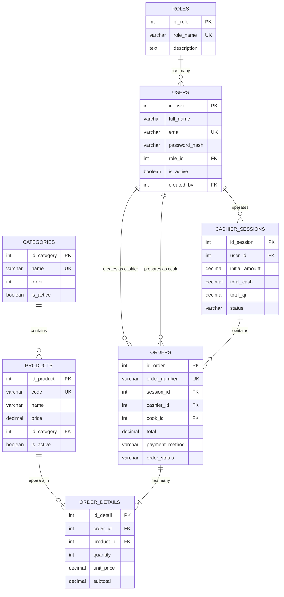
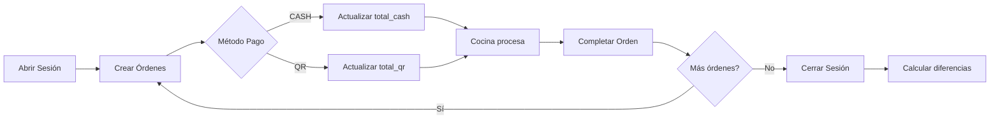

# 📚 FastCashierBE - Contexto del Proyecto

> Documentación esencial para trabajar con este proyecto. Sistema de punto de venta (POS) construido con NestJS + TypeORM + PostgreSQL.

---

## 🎯 Información General

**FastCashierBE** es un backend API REST para punto de venta que gestiona:
- Usuarios con roles (Admin, Cajero, Cocina)
- Productos categorizados  
- Órdenes con detalles de productos
- Sesiones de caja con tracking por método de pago (Efectivo/QR)

**Stack:** NestJS 11 + TypeORM 0.3.27 + PostgreSQL + JWT

---

## 📊 Diagrama de Base de Datos



---

## 🗂 Entidades Clave

### 1. **Role** → `roles`
Roles del sistema: ADMIN, CASHIER, KITCHEN

**Relaciones:**
- `1:N` con User

---

### 2. **User** → `users`
Usuarios del sistema con autenticación

**Campos importantes:**
- `email` (único, para login)
- `passwordHash` (bcrypt, no se selecciona por defecto)
- `isActive` (soft delete)

**Relaciones:**
- `N:1` con Role
- `N:1` consigo mismo (created_by, auto-referencial)
- `1:N` con CashierSession
- `1:N` con Order (como cashier y cook)

---

### 3. **Category** → `categories`
Categorías de productos con ordenamiento

**Índices:** name, order, isActive

**Relaciones:**
- `1:N` con Product

---

### 4. **Product** → `products`
Productos del inventario

**Campos importantes:**
- `code` (único)
- `price` (decimal 10,2)

**Índices:** 
- Compuesto: `[idCategory, isActive]`
- Simple: `idCategory`

**Relaciones:**
- `N:1` con Category
- `1:N` con OrderDetail

---

### 5. **CashierSession** → `cashier_sessions`
Sesiones de caja diarias

**Campos importantes:**
- `totalCash`, `totalQr` (acumulados durante el día)
- `closingCashAmount`, `closingQrAmount` (montos reales al cerrar)
- `difference` (calculado automáticamente)
- `status` (OPEN/CLOSED)

**Relaciones:**
- `N:1` con User
- `1:N` con Order

---

### 6. **Order** → `orders`
Órdenes/pedidos

**Campos importantes:**
- `orderNumber` (único, auto-generado)
- `paymentMethod` (CASH/QR)
- `orderStatus` (PENDING → IN_PROGRESS → COMPLETED/CANCELLED)
- `cascade: true, eager: true` en detalles

**Relaciones:**
- `N:1` con CashierSession
- `N:1` con User (cashier)
- `N:1` con User (cook, opcional)
- `1:N` con OrderDetail

---

### 7. **OrderDetail** → `order_details`
Líneas de productos en cada orden

**Campos importantes:**
- `unitPrice` (precio histórico al momento de venta)
- `subtotal` (quantity × unitPrice)
- `onDelete: CASCADE` (se borran con la orden)

**Relaciones:**
- `N:1` con Order
- `N:1` con Product

---

## 🧩 Módulos

### 1. **AuthModule**
Autenticación JWT con Passport

**Endpoints:**
- `POST /api/auth/login` → { email, password }
- `POST /api/auth/register` → { fullName, email, password, roleId }
- `GET /api/auth/profile` (protegido)

**Guards:**
- `JwtAuthGuard` → Validar token JWT
- `RolesGuard` → Validar rol con `@Roles('ADMIN')`

**Decoradores:**
- `@CurrentUser()` → Obtener usuario autenticado
- `@Roles(...roles)` → Definir roles permitidos

---

### 2. **UsersModule**
CRUD de usuarios + seeder

**Endpoints:** `/api/users`

---

### 3. **RolesModule**
Gestión de roles + seeder

**Endpoints:** `/api/roles`

---

### 4. **CategoriesModule**
CRUD de categorías + seeder

**Endpoints:** `/api/categories`

---

### 5. **ProductsModule**
CRUD de productos + seeder

**Endpoints:** `/api/products`

---

### 6. **CashierSessionsModule**
Gestión de sesiones de caja

**Endpoints clave:**
- `POST /api/cashier-sessions` → Abrir sesión
- `GET /api/cashier-sessions/active` → Sesión activa
- `PATCH /api/cashier-sessions/:id/close` → Cerrar sesión

---

### 7. **OrdersModule**
Gestión de órdenes con cascade save

**Endpoints clave:**
- `POST /api/orders` → Crear orden (incluye detalles)
- `PATCH /api/orders/:id/status` → Cambiar estado

---

### 8. **OrderDetailsModule**
Manejado automáticamente por OrdersModule

---

## ⚙️ Configuración

### Variables de Entorno (.env)
```env
DB_HOST=localhost
DB_PORT=5432
DB_USERNAME=postgres
DB_PASSWORD=tu_password
DB_NAME=punto_venta_db

JWT_SECRET=tu_secret_super_seguro
JWT_EXPIRATION=24h

PORT=3000
NODE_ENV=development
```

### TypeORM
- `synchronize: true` solo en development
- `logging: true` solo en development
- Autodescubrimiento de entidades: `**/*.entity{.ts,.js}`

### Validación Global
```typescript
new ValidationPipe({
  whitelist: true,
  forbidNonWhitelisted: true,
  transform: true,
})
```

---

## 🌱 Seeders

Ejecutados automáticamente en `main.ts` al iniciar:

1. **Roles:** ADMIN, CASHIER, KITCHEN
2. **Usuarios:**
   - admin@gmail.com / 123456
   - cashier@gmail.com / 123456
   - cook@gmail.com / 123456
3. **Categorías:** COMIDA, REFRESCOS, BEBIDAS CALIENTES, POSTRES
4. **Productos:** 5 productos de ejemplo

Los seeders verifican existencia antes de insertar (idempotentes).

---

## 🚀 Flujo de Operación



---

## 📝 Convenciones

1. **Nomenclatura BD:** snake_case en columnas, camelCase en TypeScript
   ```typescript
   @Column({ name: 'full_name' })
   fullName: string;
   ```

2. **DTOs:** Validar con class-validator
   ```typescript
   @IsString()
   @IsNotEmpty()
   fullName: string;
   ```

3. **Relaciones:** `@JoinColumn` en el lado N:1

---

## 🔒 Seguridad

✅ Contraseñas hasheadas (bcrypt)  
✅ JWT con expiración configurable  
✅ ValidationPipe global  
✅ Guards en rutas protegidas  
✅ `select: false` en password  
⚠️ CORS habilitado globalmente (configurar para producción)

---

## 🚀 Comandos

```bash
npm install              # Instalar dependencias
npm run start:dev        # Modo desarrollo (watch)
npm run build            # Compilar
npm run start:prod       # Producción
npm run test             # Tests unitarios
npm run test:e2e         # Tests E2E
npm run lint             # ESLint
npm run format           # Prettier
```

---

## 📌 Archivos Clave

- `src/app.module.ts` → Configuración principal
- `src/main.ts` → Entry point + seeders + CORS + ValidationPipe
- `src/**/*.entity.ts` → Definiciones de entidades
- `.env.example` → Variables de entorno

---

## 💡 Tips para IAs

1. Los seeders se ejecutan en cada inicio (idempotentes)
2. Todas las rutas excepto `/auth/login` y `/auth/register` requieren JWT
3. Para autorizar por rol: `@UseGuards(JwtAuthGuard, RolesGuard)` + `@Roles('ADMIN')`
4. Las órdenes usan cascade save → los detalles se guardan automáticamente
5. Relación auto-referencial en User (`created_by`)
6. Eager loading activado en `Order.details`
7. Índice compuesto en Products para optimizar queries

---

**Versión:** 0.0.1 | **Actualizado:** 2026-01-24
