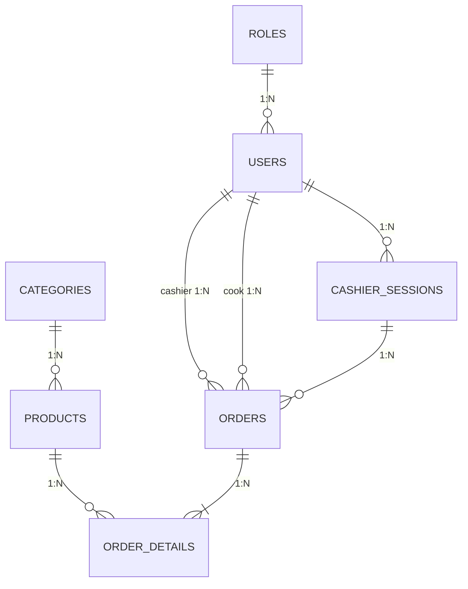

# 📚 FastCashierBE - Contexto del Proyecto

> Sistema POS construido con NestJS + TypeORM + PostgreSQL. Documentación para IAs.

---

## 🎯 Overview

**FastCashierBE** - Backend API REST para punto de venta:
- Usuarios con roles (Admin, Cajero, Cocina)
- Productos categorizados  
- Órdenes con detalles
- Sesiones de caja (Efectivo/QR)
- **Soft delete** en entidades principales
- **Documentación Swagger/OpenAPI**

**Stack:** NestJS 11 + TypeORM 0.3.27 + PostgreSQL + JWT + Swagger

---

## 📊 Diagrama Relacional



---

## 🗂 Entidades y Relaciones

### 1. **Role** → `roles`
- Roles: ADMIN, CASHIER, KITCHEN
- **1:N** con User

### 2. **User** → `users`
- `email` único (login)
- `passwordHash` con bcrypt
- `isActive` (soft delete)
- **N:1** con Role
- **N:1** consigo mismo (`created_by`)
- **1:N** con CashierSession, Order

### 3. **Category** → `categories`
- `name` único
- `order` para ordenamiento
- `isActive` (soft delete)
- **1:N** con Product

### 4. **Product** → `products`
- `code` único
- `price` decimal(10,2)
- `isActive` (soft delete)
- Índice compuesto: `[idCategory, isActive]`
- **N:1** con Category
- **1:N** con OrderDetail

### 5. **CashierSession** → `cashier_sessions`
- `totalCash`, `totalQr` (acumulados)
- `closingCashAmount`, `closingQrAmount` (reales)
- `difference` (calculado)
- `status` (OPEN/CLOSED)
- **N:1** con User
- **1:N** con Order

### 6. **Order** → `orders`
- `orderNumber` único (auto-generado)
- `paymentMethod` (CASH/QR)
- `orderStatus` (PENDING → IN_PROGRESS → COMPLETED/CANCELLED)
- `cascade: true` y `eager: true` en detalles
- **N:1** con CashierSession, User (cashier), User (cook)
- **1:N** con OrderDetail

### 7. **OrderDetail** → `order_details`
- `unitPrice` (histórico)
- `subtotal` (quantity × unitPrice)
- `onDelete: CASCADE`
- **N:1** con Order, Product

---

## 🧩 Módulos

### AuthModule
**Autenticación JWT con Passport**

Endpoints:
- `POST /api/auth/login`
- `POST /api/auth/register`
- `GET /api/auth/profile` (protegido)

Guards: `JwtAuthGuard`, `RolesGuard`  
Decoradores: `@CurrentUser()`, `@Roles(...)`

### UsersModule, CategoriesModule, ProductsModule
**CRUD + Soft Delete**

Endpoints por módulo:
- `GET /{resource}` - Todos
- `GET /{resource}/active` - Solo activos
- `GET /{resource}/inactive` - Solo inactivos
- `POST /{resource}` - Crear
- `PATCH /{resource}/:id` - Actualizar (parcial)
- `DELETE /{resource}/:id` - Soft delete (isActive=false)
- `PATCH /{resource}/:id/toggle-active` - Toggle estado

### OrdersModule
Gestión de órdenes con cascade save

- `POST /api/orders` - Crear orden (incluye items)
- `PATCH /api/orders/:id/status` - Cambiar estado

### CashierSessionsModule
Gestión de sesiones de caja

- `POST /api/cashier-sessions` - Abrir sesión
- `GET /api/cashier-sessions/active` - Sesión activa
- `PATCH /api/cashier-sessions/:id/close` - Cerrar sesión

---

## ⚙️ Configuración

### Variables de Entorno (.env)
```env
DB_HOST=localhost
DB_PORT=5432
DB_USERNAME=postgres
DB_PASSWORD=tu_password
DB_NAME=punto_venta_db

JWT_SECRET=tu_secret_super_seguro
JWT_EXPIRATION=24h

PORT=3000
NODE_ENV=development
```

### TypeORM
- `synchronize: true` solo en development
- Autodescubrimiento: `**/*.entity{.ts,.js}`

### Validation Pipe
```typescript
whitelist: true
forbidNonWhitelisted: true
transform: true
```

---

## 📚 Swagger/OpenAPI

**URL:** `http://localhost:3000/api/docs`  
**JSON:** `http://localhost:3000/api/docs-json`

**Configuración:**
- Todos los DTOs tienen decoradores `@ApiProperty`
- UpdateDtos usan `PartialType` de `@nestjs/swagger`
- Autenticación JWT configurada
- Tags por módulo

**Exportar a Postman:**
1. Ir a `http://localhost:3000/api/docs-json`
2. Copiar URL o descargar JSON
3. Importar en Postman

---

## 🌱 Seeders

Ejecutados automáticamente en `main.ts`:

1. **Roles:** ADMIN, CASHIER, KITCHEN
2. **Usuarios:**
   - admin@gmail.com / 123456
   - cashier@gmail.com / 123456
   - cook@gmail.com / 123456
3. **Categorías:** COMIDA, REFRESCOS, BEBIDAS CALIENTES, POSTRES
4. **Productos:** 5 productos ejemplo

---

## � Soft Delete

**Implementado en:** Users, Categories, Products

- DELETE no elimina físicamente
- Cambia `isActive = false`
- Validaciones:
  - Categories: No se puede desactivar con productos activos
  - Products: Aviso si tiene historial de órdenes
  - Users: Siempre permite desactivar

---

## 🚀 Comandos

```bash
npm install              # Instalar
npm run start:dev        # Desarrollo
npm run build            # Compilar
npm run start:prod       # Producción
```

---

## � Tips para IAs

1. Seeders idempotentes (ejecutan en cada inicio)
2. Rutas protegidas requieren JWT (excepto `/auth/login` y `/auth/register`)
3. Autorización: `@UseGuards(JwtAuthGuard, RolesGuard)` + `@Roles('ADMIN')`
4. Órdenes con cascade save (detalles automáticos)
5. Swagger genera docs automáticas
6. PATCH para updates parciales
7. Soft delete preserva historial e integridad

---

## 📌 Archivos Clave

- `src/app.module.ts` → Config principal
- `src/main.ts` → Entry point + seeders + Swagger
- `src/**/*.entity.ts` → Entidades
- `src/**/*.dto.ts` → DTOs con decoradores Swagger
- `.env.example` → Variables de entorno

---

**Versión:** 1.0 | **Actualizado:** 2026-01-24  
**Cambios recientes:** Soft delete, endpoints /active y /inactive, Swagger/OpenAPI
